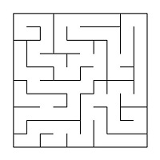
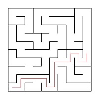
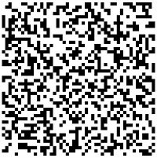
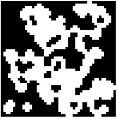

# Maze

Реализация проекта Maze.

## Contents

1. [Chapter I](#chapter-i) \
    1.1. [Introduction](#introduction)
2. [Chapter II](#chapter-ii) \
    2.1. [Information](#information)
3. [Chapter III](#chapter-iii) \
    3.1. [Part 1](#part-1-реализация-проекта-maze) \
    3.2. [Part 2](#part-2-генерация-идеального-лабиринта) \
    3.3. [Part 3](#part-3-решение-лабиринта) \
    3.4. [Part 4](#part-4-дополнительно-генерация-пещер) \
    3.5. [Part 5](#part-5-дополнительно-ml-обучение-с-подкреплением) \
    3.6. [Part 6](#part-6-дополнительно-web-интерфейс) 


## Chapter I

## Introduction

В данном проекте тебе предстоит познакомиться с лабиринтами и пещерами, а также основными алгоритмами их обработки, такими как: генерация, отрисовка, поиск решения.


## Chapter II

## Information

Лабиринт с «тонкими стенками» представляет собой таблицу размером _n_ строк на _m_ столбцов. 
Между ячейками таблицы могут находиться «стены». Также «стенами» окружена вся таблица в целом. 

Далее приведён пример такого лабиринта: \


Решением лабиринта считается кратчайший путь от заданной начальной точки (ячейки таблицы) до конечной. 
При прохождении лабиринта можно передвигаться к соседним ячейкам, не отделенным «стеной» от текущей ячейки и находящимся сверху, снизу, справа или слева. 
Кратчайшим маршрут считается, если он проходит через наименьшее число ячеек.

Пример лабиринта с его решением: \


В этом примере начальная точка задана, как 10; 1, а конечная, как 6; 10.

## Описание лабиринта

Лабиринт может храниться в файле в виде количества строк и столбцов, а также двух матриц, содержащих положение вертикальных и горизонтальных стен соответственно. 
В первой матрице отображается наличие стены справа от каждой ячейки, а во второй - снизу. 

Пример подобного файла:  
```
4 4
0 0 0 1
1 0 1 1
0 1 0 1
0 0 0 1

1 0 1 0
0 0 1 0
1 1 0 1
1 1 1 1
```

Лабиринт, описанный в этом файле: \


Больше примеров описания лабиринтов можно найти в материалах.

## Недостатки лабиринтов

К недостаткам лабиринтов относятся изолированные области и петли.

Изолированная область - это часть лабиринта с проходами, в которые нельзя попасть из оставшейся части лабиринта. Например: \


Петля - это часть лабиринта с проходами, по которым можно ходить «кругами». Стены в петлях не соединены со стенами, окружающими лабиринт. Например: \


## Генерация с использованием клеточного автомата

Во многих играх есть необходимость в ветвящихся локациях, например пещерах. 
Такие локации могут быть созданы генерацией с использованием клеточного автомата. 
При подобной генерации используется идея, схожая с уже знакомой тебе игрой «Жизнь». 
Суть предложенного алгоритма состоит в реализации всего двух шагов: 
сначала все поле заполняется случайным образом стенами — т.е. для каждой клетки случайным образом определяется, 
будет ли она свободной или непроходимой — а затем несколько раз происходит обновление состояния карты в соответствии с условиями, похожими на условия рождения/смерти в «Жизни».

Правила проще, чем в «Жизни» - есть две специальные переменные, одна для «рождения» «мертвых» клеток (предел «рождения») и одна для уничтожения «живых» клеток (предел «смерти»). 
Если «живые» клетки окружены «живыми» клетками, количество которых меньше, чем предел «смерти», они «умирают». 
Аналогично если «мертвые» клетки находятся рядом с «живыми», количество которых больше, чем предел «рождения», они становятся «живыми».

Пример результата работы алгоритма (на первой картинке только инициализированный лабиринт, а на второй лабиринт, в котором при последующих шагах больше не происходит изменений): \



## Описание пещер

Пещера, прошедшая 0 шагов симуляции (только инициализированная), может храниться в файле в виде количества строк и столбцов, 
а также матрицы, содержащей положение «живых» и «мертвых» клеток.

Пример подобного файла:
```
4 4
0 1 0 1
1 0 0 1
0 1 0 0
0 0 1 1
```

Пещера, описанная в этом файле: \


Больше примеров описания пещер можно найти в материалах.


## Chapter III

## Part 1. Реализация проекта Maze

Необходимо реализовать программу Maze, позволяющую генерировать и отрисовывать идеальные лабиринты и пещеры:

- Программа должна быть разработана на языке Python
- Код программы должен находиться в папке src
- При написании кода необходимо придерживаться Google Style
- Сборка программы должна быть настроена с помощью Makefile со стандартным набором целей для GNU-программ: all, install, uninstall, clean, dvi, dist, tests. Установка должна вестись в любой другой произвольный каталог
- В программе должен быть реализован графический пользовательский интерфейс на базе любой GUI-библиотеки для Python
- В программе предусмотрена кнопка для загрузки лабиринта из файла, который задается в формате, описанном [выше](#описание-лабиринта) 
- Максимальный размер лабиринта - 50х50
- Загруженный лабиринт должен быть отрисован на экране в поле размером 500 x 500 пикселей
- Толщина «стены» - 2 пикселя
- Размер самих ячеек лабиринта вычисляется таким образом, чтобы лабиринт занимал всё отведенное под него поле

## Part 2. Генерация идеального лабиринта

Добавить возможность автоматической генерации идеального лабиринта. \
Идеальным считается лабиринт, в котором из каждой точки можно попасть в любую другую точку ровно одним способом.

- Генерировать лабиринт нужно согласно **алгоритму Эллера**
- Сгенерированный лабиринт не должен иметь изолированных областей и петель
- Должно быть обеспечено полное покрытие unit-тестами модуля генерации идеального лабиринта
- Пользователем вводится только размерность лабиринта: количество строк и столбцов
- Сгенерированный лабиринт должен сохраняться в файл в формате, описанном [выше](#описание-лабиринта) 
- Созданный лабиринт должен отображаться на экране как указано в [первой части](#part-1-реализация-проекта-maze)

## Part 3. Решение лабиринта

Добавить возможность показать решение _любого_ лабиринта, который сейчас изображен на экране:
- Пользователем задаются начальная и конечная точки
- Маршрут, являющийся решением, отобразить линией толщиной 2 пикселя, проходящей через середины всех ячеек лабиринта, через которые пролегает решение
- Цвет линии решения должен быть отличным от цветов стен и поля
- Должно быть обеспечено полное покрытие unit-тестами модуля решения лабиринта

## Part 4. Дополнительно. Генерация пещер

Добавить генерацию пещер с [использованием клеточного автомата](#генерация-с-использованием-клеточного-автомата):
- Пользователем выбирается файл, в котором описан пещера по описанному [выше](#описание-пещер) формату
- Для отображения пещер использовать отдельное окно или вкладку пользовательского интерфейса
- Максимальный размер пещеры - 50 х 50
- Загруженная пещера должна быть отрисована на экране в поле размером 500 x 500 пикселей
- Пользователем задаются пределы «рождения» и «смерти» клетки, а также шанс на начальную инициализацию клетки
- Пределы «рождения» и «смерти» могут иметь значения от 0 до 7
- Клетки за границей пещеры считаются живыми
- Должен быть предусмотрен пошаговый режим отрисовки результатов работы алгоритма в двух вариантах:
  - По нажатию на кнопку следующего шага отрисовывается очередная итерация работы алгоритма
  - По нажатию на кнопку автоматической работы запускается отрисовка итераций работы алгоритма с частотой 1 шаг в `N` миллисекунд, где число миллисекунд `N` задаётся через специальное поле в пользовательском интерфейсе
- Размер клеток в пикселях вычисляется таким образом, чтобы пещера занимала всё отведенное под него поле
- Должно быть обеспечено полное покрытие unit-тестами модуля генерации пещер

## Part 5. Дополнительно. ML. Обучение с подкреплением

С помощью обучения с подкреплением необходимо разработать алгоритм обучения агента кратчайшему прохождению лабиринтов:
- Пользователем указывается файл, в котором описана структура лабиринта, и конечная точка
- Агент должен быть способен находить выход из лабиринта из любой начальной точки
- Необходимо использовать метод Q-обучения
- Агент обучается на одном лабиринте, который не меняется ни в процессе обучения, ни на этапе тестирования; конечная точка также фиксирована
- Должно быть обеспечено полное покрытие unit-тестами модуля обучения агента

Требуется предоставить пользователю возможность взаимодействия с обученным агентом:
- Пользователь определяет начальную точку
- Построенный агентом маршрут из заданной точки отображается в соответствии с описанными выше правилами

Модули обучения агента и взаимодействия с ним должны быть разработаны на языке Python без использования готовых библиотек обучения с подкреплением.

## Part 6. Дополнительно. Web-интерфейс

Добавить Web-версию пользовательского интерфейса в любом формате (MPA, SPA) с использованием соответствующих фреймворков. Web интерфейс должен удовлетворять как минимум всем базовым функциональным требованиям из частей выше ([Part 1](#part-1-реализация-проекта-maze)-[Part 3](#part-3-решение-лабиринта)).
