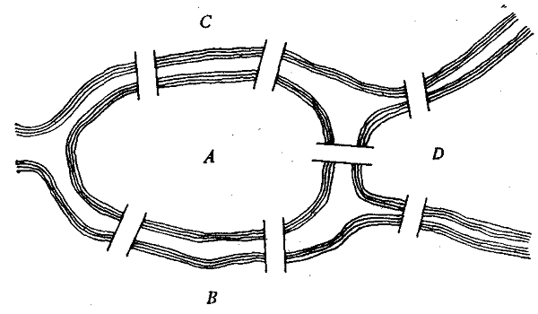
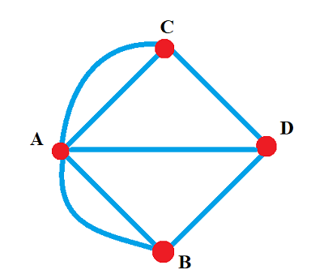
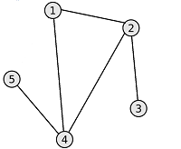
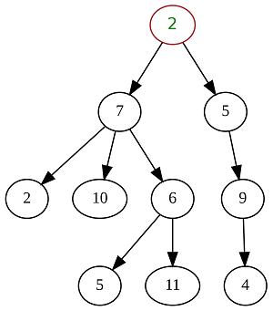
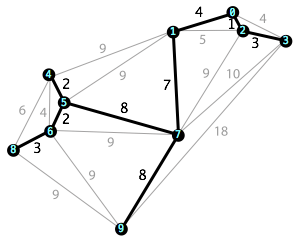

# SimpleNavigator

Реализация проекта Simple Navigator.

## Contents

1. [Chapter I](#chapter-i) \
    1.1. [Introduction](#introduction)
2. [Chapter II](#chapter-ii) \
    2.1. [Information](#information)
3. [Chapter III](#chapter-iii) \
    3.1. [Part 1](#part-1-обход-графа-в-глубину-и-в-ширину)  
    3.2. [Part 2](#part-2-поиск-кратчайших-путей-в-графе)  
    3.3. [Part 3](#part-3-поиск-минимального-остовного-дерева)  
    3.4. [Part 4](#part-4-задача-коммивояжера)  
    3.5. [Part 5](#part-5-консольный-интерфейс)  
    3.6. [Part 6](#part-6-дополнительно-сравнение-методов-решения-задачи-коммивояжера)  
4. [Chapter IV](#chapter-iv)


## Chapter I

## Introduction

В данном проекте тебе предстоит реализовать несколько основных алгоритмов на графах. Графы являются одной из базовых структур данных в программировании, которая используется повсеместно. В виде графов можно, например, интерпретировать схемы дорог, электрические цепи, географические карты, связи между людьми в социальных сетях и многое-многое другое.  


## Chapter II

## Information

### Историческая справка

Родоначальником теории графов принято считать математика Леонарда Эйлера (1707-1783). Историю возникновения этой теории можно проследить по переписке великого ученого. Вот перевод латинского текста, который взят из письма Эйлера к итальянскому математику и инженеру Маринони, отправленного из Петербурга 13 марта 1736 года:

>Недавно мне была предложена задача об острове, расположенном в городе Кёнигсберге и окруженном рекой, через которую перекинуто семь мостов.

Возникший в XIII веке город Кёнигсберг (ныне Калининград) состоял из трёх формально независимых городских поселений и ещё нескольких «слобод» и «посёлков». Расположены они были на островах и берегах реки Прегель, делящей город на четыре главные части: А) Альтштадт, Б) Кнайпхоф, В) Ломзе, Г) Форштанд. Для связи между городскими частями уже в XIV веке стали строить мосты. В связи с постоянной военной опасностью мосты имели оборонные качества. Мосты были местом шествий, религиозных и праздничных процессий, по мостам проходили православные крестные ходы. Карта этой местности и её упрощённая схема представлены на рисунках ниже.




>Спрашивается, может ли кто-нибудь непрерывно обойти их, проходя только единожды через каждый мост. И тут же мне было сообщено, что никто еще до сих пор не мог это проделать, но никто и не доказал, что это невозможно. Вопрос этот, хотя и банальный, показался мне, однако, достойным внимания тем, что для его решения недостаточны ни геометрия, ни алгебра, ни комбинаторное искусство. После долгих размышлений я нашел легкое правило, основанное на вполне убедительном доказательстве, с помощью которого можно во всех задачах такого рода тотчас же определить, может ли быть совершен такой обход через какое угодно число и как угодно расположенных мостов или не может. Кёнигсбергские же мосты расположены так, что их можно представить на следующем рисунке, где вершины графа соответствуют определённому району города, а ребра — мостам через реку, на котором A обозначает остров, а B, C и D — части континента, отделенные друг от друга рукавами реки.



Так можно ли обойти Кёнигсбергские мосты, проходя только один раз через каждый из этих мостов? Чтобы найти ответ, продолжим письмо Эйлера к Маринони: 

>Вопрос состоит в том, чтобы определить, можно ли обойти все эти семь мостов, проходя через каждый только единожды, или нельзя. Мое правило приводит к следующему решению этого вопроса. Прежде всего, нужно смотреть, сколько есть участков, разделенных водой, — таких, у которых нет другого перехода с одного на другой, кроме как через мост. В данном примере таких участков четыре — A, B, C, D. Далее нужно различать, является ли число мостов, ведущих к этим отдельным участкам, четным или нечетным. Так, в нашем случае к участку A ведут пять мостов, а к остальным — по три моста, т. е. число мостов, ведущих к отдельным участкам, нечетно, а этого одного уже достаточно для решения задачи. Когда это определено, применяем следующее правило: если бы число мостов, ведущих к каждому отдельному участку, было четным, то тогда обход, о котором идет речь, был бы возможен, и в то же время можно было бы начать этот обход с любого участка. Если же из этих чисел два были бы нечетные, ибо только одно быть нечетным не может, то и тогда мог бы совершиться переход, как это предписано, но только начало обхода непременно должно быть взято от одного из тех двух участков, к которым ведет нечетное число мостов. Если бы, наконец, было больше двух участков, к которым ведет нечетное число мостов, то тогда такое движение вообще невозможно… если можно было привести здесь другие, более серьезные задачи, этот метод мог бы принести еще большую пользу, и им не следовало бы пренебрегать.

Перефразируя слова ученого, можно сформулировать следующие правила:
1) Число нечётных вершин (вершин, к которым ведёт нечётное число рёбер) графа должно быть чётно. Не может существовать граф, который имел бы нечётное число нечётных вершин.
2) Если все вершины графа чётные (вершины, к которым ведёт чётное число рёбер), то можно, не отрывая карандаша от бумаги, начертить граф, при этом можно начинать с любой вершины графа и завершить его в той же вершине.
3) Граф с более чем двумя нечётными вершинами невозможно начертить одним росчерком.

Граф Кёнигсбергских мостов имел четыре нечётные вершины, следовательно, невозможно пройти по всем мостам, не проходя ни по одному из них дважды.

Далее, вплоть до начала 20-го века теория графов развивалась в основном в виде формулирования новых теорем, сформированных по результатам решения различных «задач-головоломок». Серьезное развитие теория графов получила в связи с возникновением массового крупносерийного производства, общим всплеском науки и технологий в первой половине 20-го века.

### Основные определения

**Граф** — это совокупность конечного множества вершин и множества ребер. Каждому ребру сопоставлены две точки из множества вершин графа, образующие граничные точки ребра.

**Виды графов по типу рёбер:**
* *Неориентированный* — граф, в котором перемещение между вершинами, соединёнными ребром, возможно в любом направлении.


* *Ориентированный* — граф, рёбрам которого присвоено направление. Направленные рёбра именуются также дугами. Перемещение из одной вершины в другую возможно только по дугам соответствующего направления.


Если помимо наличия ребра между двумя вершинами, задан ещё и вес ребра, то такой граф называется ***взвешенным***.


**Виды графов по числу рёбер:**
* *Нулевой* — в графе отсутствуют рёбра.


* *Неполный* — в графе есть рёбра, но не из каждой вершины есть ребро в любую другую вершину.


* *Полный* — в графе из каждой вершины есть ребро в любую другую вершину.


**Виды графов по достижимости узлов:**
* *Связный* — для любой вершины в графе есть хотя бы один путь до любой другой вершины в этом же графе.



* *Несвязный* — в графе отсутствует путь хотя бы между двумя его вершинами.


Для ориентированных графов дополнительно разделяют ещё два типа связности: *сильносвязный* и *слабосвязный*.
* *Сильносвязный* — для любой вершины в ориентированном графе существует путь в любую другую вершину и обратно.
* *Слабосвязный* — между двумя любыми вершинами в графе существует путь, но этот путь может быть односторонним. Т. е. из вершины А в вершину B путь может существовать, а обратно нет.

**Деревья**

Отдельным важным подтипом графов являются *деревья*. \
***Дерево*** — это связный ациклический граф, в котором любые две вершины соединены лишь одним маршрутом. Для любого дерева справедлива следующая формула: *q = n - 1*, где q — это число рёбер, n — число вершин графа (дерева). Деревья могут быть построены на базе как неориентированных графов, так и ориентированных, в зависимости от решаемой задачи.



***Остовное дерево (остов)*** — это подграф данного графа, содержащий все его вершины и являющийся деревом. Рёбра графа, не входящие в остов, называются хордами графа относительно остова.



### Способы задания графа

Существуют следующие основные способы задания графов:
* *Матрица смежности* — квадратная матрица, размерность которой равна числу вершин в графе, и в которой $`A_{ij}`$ элемент матрицы содержит в себе информацию о ребре из вершины $`i`$ в вершину $`j`$. Возможные значения, которые может принимать $`A_{ij}`$:
    + для невзвешенного неориентированного графа: 
        - 0 — ребра между вершинами нет
        - 1 — ребро между вершинами есть  
    + для взвешенного неориентированного графа: 
        - 0 — ребра между вершинами нет 
        - N — ребро между вершинами есть, и его вес равен N 
    + для невзвешенного ориентированного графа: 
        - 0 — дуги между вершинами нет
        - 1 — есть дуга (ориентированное ребро), которая направлена из вершины $`i`$ в вершину $`j`$
    + для взвешенного ориентированного графа: 
        - 0 — дуги между вершинами нет
        - N — есть дуга (ориентированное ребро), которая направлена из вершины $`i`$ в вершину $`j`$, и её вес равен N
* *Матрица инцидентности* — это матрица, количество строк в которой соответствует числу вершин, а количество столбцов — числу рёбер. В ней указываются связи между инцидентными элементами графа (ребро (дуга) и вершина). В неориентированном графе если вершина инцидентна ребру, то соответствующий элемент равен 1, в противном случае элемент равен 0. В ориентированном графе если ребро выходит из вершины, то соответствующий элемент равен 1; если ребро входит в вершину, то соответствующий элемент равен -1; если ребро отсутствует, то элемент равен 0.

Пример задания графа с помощью матрицы смежности можно найти в материалах.

Если количество ребер графа по сравнению с количеством вершин невелико, то значения большинства элементов матрицы смежности будут равны 0. При этом использование данного метода нецелесообразно. Для подобных графов имеются более оптимальные способы их представления:

* *Список смежности* — один из способов представления графа в виде коллекции списков вершин. Каждой вершине графа соответствует список, состоящий из «соседей» (т. е. из вершин, которые непосредственно достижимы напрямую из текущей вершины) этой вершины с указанием весов рёбер.
* *Список рёбер* — таблица (матрица размерностью Nx3), в каждой строке которой записаны две смежные вершины и вес, соединяющего их ребра.


## Chapter III

В рамках данного задания все графы должны удовлетворять следующим требованиям:
- Веса ребер только натуральными числами.
- Могут быть петли.
- Веса могут отличаться на всех ребрах.
- Только ненулевой связный граф.

## Part 1. Обход графа в глубину и в ширину

Реализуй библиотеку my_graph:
* Библиотека должна быть разработана на языке Python.
* Код библиотеки должен находиться в папке src в ветке develop.  
* При написании кода придерживайся PEP8.
* Оформи решение как статическую библиотеку (my_graph).
* Библиотека должна быть представлена в виде класса `Graph`, который хранит в себе информацию о графе с помощью **матрицы смежности**. Размерность матрицы смежности должна задаваться динамически при инициализации графа (при его загрузке из файла).
* Сборка программы должна быть настроена с помощью Makefile со стандартным набором целей для GNU-программ: all, clean, test, my_graph.
* Обеспечь полное покрытие unit-тестами методов класса `Graph`.
* Класс `Graph` должен содержать в себе по крайней мере следующие публичные методы:
    + `def load_graph_from_file(filename)` — загрузка графа из файла в формате матрицы смежности.
    + `def export_graph_to_dot(filename)` — выгрузка графа в файл в формате dot (см. материалы).

Реализуй библиотеку my_graph_algorithms:
* Библиотека должна быть разработана на языке Python.
* Код библиотеки должен находиться в папке src в ветке develop.  
* Оформи решение как статическую библиотеку (my_graph_algorithms).
* Библиотека должна быть представлена в виде класса `GraphAlgorithms`, который будет содержать в себе реализацию алгоритмов на графах. При этом сам класс `GraphAlgorithms` не должен ничего знать о внутреннем представлении графа из класса `Graph`. Для взаимодействия с данными графа класс `GraphAlgorithms` может использовать только публичные методы и свойства, предоставляемые классом `Graph`.
* Добавь в Makefile цель my_graph_algorithms.
* Обеспечь полное покрытие unit-тестами методов класса `GraphAlgorithms`.
* Класс `GraphAlgorithms` должен содержать в себе по крайней мере следующие публичные методы:    
    + `def depth_first_search(graph, start_vertex)` — *нерекурентный* поиск в глубину в графе от заданной вершины. Функция должна возвращать массив, содержащий в себе обойдённые вершины в порядке их обхода. При реализации этой функции обязательно использовать *самописную* структуру данных **стек**, которую предварительно стоит оформить в виде отдельной статической библиотеки.
    + `def breadth_first_search(graph, start_vertex)` — поиск в ширину в графе от заданной вершины. Функция должна возвращать массив, содержащий в себе обойдённые вершины в порядке их обхода. При реализации этой функции обязательно использовать *самописную* структуру данных **очередь**, которую предварительно стоит оформить в виде отдельной статической библиотеки.
* Необходимо адаптировать ранее созданные *самописные* вспомогательные классы `Stack` и `Queue` (для этого можно переиспользовать своё решение из проекта *CPP2*) и реализовать для них интерфейсы на Python. Эти классы должны содержать в себе следующие методы:
    + `stack()` — создание пустого стека;
    + `queue()` — создание пустой очереди;
    + `push(value)` — добавление элемента в стек/очередь;
    + `pop()` — получение элемента из стека/очереди с его последующим удалением из стека/очереди;
    + `top()` — получение элемента из стека без его удаления из стека;
    + `front()` — получение первого элемента из очереди без его удаления из очереди;
    + `back()` — получение последнего элемента из очереди без его удаления из очереди.

*В этом и последующих заданиях считай, что номера вершин начинаются с 1.*

## Part 2. Поиск кратчайших путей в графе

* Добавь в класс `GraphAlgorithms` два новых метода:
    + `def get_shortest_path_between_vertices(graph, vertex1, vertex2)` — поиск кратчайшего пути между двумя вершинами в графе с использованием *алгоритма Дейкстры*. Функция принимает на вход номера двух вершин и возвращает численный результат, равный наименьшему расстоянию между ними.
    + `def get_shortest_paths_between_all_vertices(graph)` — поиск кратчайших путей между всеми парами вершин в графе с использованием *алгоритма Флойда-Уоршелла*. В качестве результата функция возвращает матрицу кратчайших путей между всеми вершинами графа.

## Part 3. Поиск минимального остовного дерева

* Добавь в класс `GraphAlgorithms` новый метод:
    + `def get_least_spanning_tree(graph)` — поиск наименьшего остовного дерева в графе с помощью *алгоритма Прима*. В качестве результата функция должна возвращать матрицу смежности для минимального остовного дерева.

## Part 4. Задача коммивояжера

* Добавь в класс `GraphAlgorithms` новый метод:
    + `def solve_traveling_salesman_problem(graph)` — решение задачи коммивояжера с помощью *муравьиного алгоритма*. Необходимо найти самый выгодный (короткий) маршрут, проходящий через все вершины графа хотя бы по одному разу с последующим возвратом в исходную вершину. В качестве результата функция должна возвращать класс `TsmResult`, описанный ниже:
    ```python
    class TsmResult(ctypes.Structure):
        _fields_ = [("vertices", ctypes.POINTER(ctypes.c_int_p)), ("distance", ctypes.c_double)]

    // vertices - массив с искомым маршрутом (с порядком обхода вершин)
    // distance - длина этого маршрута
    ``` 

*Если при заданном графе решение задачи невозможно, выведи ошибку.*

## Part 5. Консольный интерфейс

* Напиши основную программу, которая представляет из себя консольное приложение для проверки работоспособности реализованных библиотек my_graph и my_graph_algorithms
* Консольный интерфейс обязательно должен покрывать следующий функционал:
    1. Загрузка исходного графа из файла.
    2. Обход графа в ширину с выводом результата обхода в консоль.
    3. Обход графа в глубину с выводом результата обхода в консоль.
    4. Поиск кратчайшего пути между произвольными двумя вершинами с выводом результата в консоль.
    5. Поиск кратчайших путей между всеми парами вершин в графе с выводом результирующей матрицы в консоль.
    6. Поиск минимального остовного дерева в графе с выводом результирующей матрицы смежности в консоль.
    7. Решение задачи коммивояжера с выводом результирующего маршрута и его длины в консоль.

## Part 6. Дополнительно. Сравнение методов решения задачи коммивояжера

* Выбери дополнительные два алгоритма для решения задачи коммивояжера и реализовать их в виде методов класса `GraphAlgorithms`.
* Добавь в консольный интерфейс возможность проведения сравнительного исследования скорости работы трёх алгоритмов (муравьиного алгоритма и двух выбранных произвольно):
    + Исследование запускается для графа, который был предварительно загружен из файла.
    + В рамках исследования требуется засечь время, потраченное на решение задачи коммивояжера `N` раз подряд, каждым из алгоритмов. Где `N` задаётся с клавиатуры.
    + Необходимо вывести в консоль результаты замера времени. 

*Пример:* для `N = 1000` будет измерено, сколько времени уйдёт на то, чтобы 1000 раз решить задачу коммивояжера для текущего заданного графа муравьиным алгоритмом и двумя произвольно выбранными алгоритмами. 

## Chapter IV


